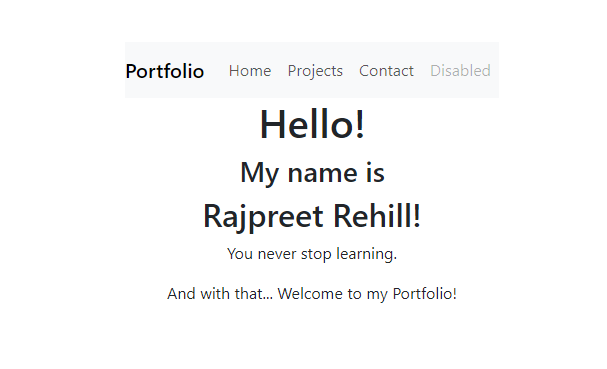

# React Portfolio
13th Module Challenge for the Front-End Web Development Bootcamp

## Description
For this week's challenge, I was tasked to create a portfolio with react. Due to time constraints over the weekend, I was unable to get much done. The purpose of this project is to showcase my current skillset. I will be continuing this project in my own time as I found it difficult knowing where to begin.

## Screenshot
Currently, my webpage looks like the following:

I plan to improve upon this foundation with a working navbar and a colour pallete that best suits me as a brand.

## Credits:
I used the following to help me reach my current code:
* Tutoring session

## Lisence
MIT Lisence

